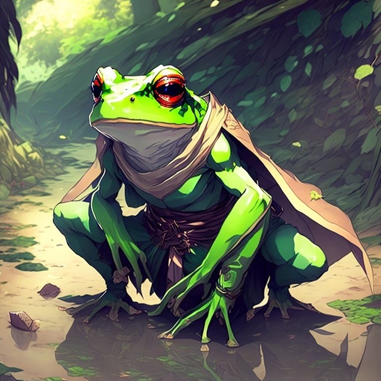
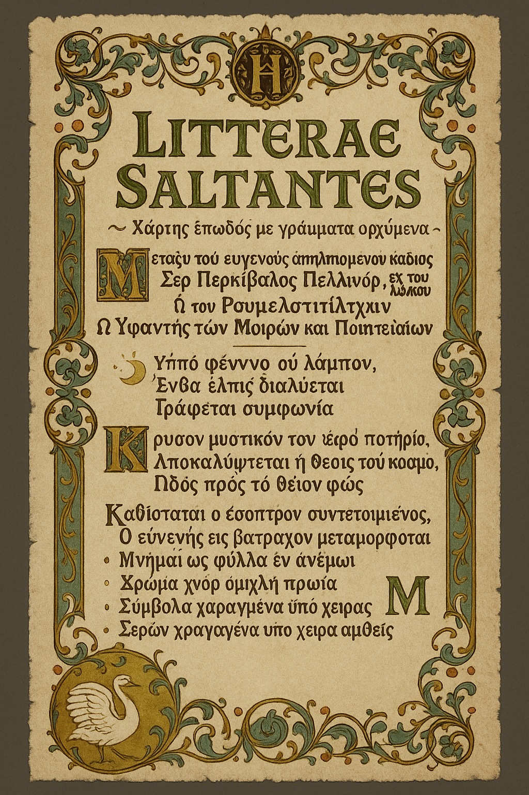

# rpg-frog

# Frog Gorf (Ex-Percival Pellinore) 

## O Sapo Mal-Humorado do Pântano

---

## **História**
Percival era um cavaleiro nobre obcecado em encontrar o Santo Graal (tradição da família Pellinore). Sua obsessão o levou a fazer um **Contrato Mágico** com uma entidade desconhecida: em troca da localização do Graal, ele perderia sua personalidade e forma humana.

**Resultado**: Virou um sapo antropomórfico grosseiro que vive num pântano perto de Tão Tão Distante.

---

## **Personalidade Atual**
- **Grosseiro**: Arrota, cospe, fala mal
- **Anti-social**: Prefere ficar sozinho no pântano
- **Distraído**: Esquece as coisas no meio da conversa
- **Territorialista**: Não gosta de visitas em casa
- **Instintivo**: Excelente caçador e sempre acha o caminho de casa

### **Quirks Estranhos**
- Entalha um símbolo estranho em tudo (brasão Pellinore) sem saber por quê
- Usa uma capa surrada e esfarrapada que se recusa a tirar
- Coleciona coisas brilhantes
- Às vezes fala palavras "fancy" sem entender o significado

---

## **itens lore**
- **Capa da Família Pellinore** (surrada, mas com brasão ainda visível)
- **Arpão de Pesca** caseiro
- **Coleção de Objetos Brilhantes** (moedas, vidros, bijuterias)
- **Ferramentas de Sobrevivência** improvisadas

---

## Experiencias

1. Frog sempre sabe o caminho de volta para casa 
2. frog se vira sozinho (sobrevicencia)

---

## **CONTRATO MÁGICO**
*~ Pergaminho Encantado com Letras que Dançam ~*

**Entre o Nobre Coração Desesperado**  
*Sir Percival Pellinore da Casa Antiga*  
**E Rumpelstiltskin**  
*O Tecelão de Destinos e Fazedor de Acordos*

---

*🌙 Sob a lua que não brilha,*  
*Onde esperança se esvai,*  
*Um acordo se escreve*  
*Com tinta que jamais sai.*

*O segredo dourado do cálice sagrado,*  
*Seu lugar no mundo revelado,*  
*O caminho até a luz divina,*  
*Para a busca que nunca termina.*

*A face do espelho quebra-se,*  
*O nobre em rã transforma-se,*  
*Memórias como folhas ao vento,*  
*Grosseria em place do talento.*

- *Pele verde como esmeralda do pântano*
- *Palavras rudes onde havia doçura*  
- *Lembranças como névoa da manhã*
- *Instintos selvagens despertados*
- *Símbolos gravados por mãos que não sabem*

---

### **CLÁUSULA SECRETA** 
*Os detalhes da "cláusula de saída" só podem ser encontrados no contrato uma vez que tenha sido reorganizado via origami*

*🗝️ Quando o coração egoísta se quebrar,*  
*E por outros escolher se sacrificar,*  
*Quando dar for maior que receber,*  
*O feitiço poderá se desfazer.*

**✨ "Todo desejo tem seu preço... e alguns custam mais do que imaginamos." ✨**

# Mais Falas e Comportamentos para Frog Gorf 🐸

## **Falas por Situação**

### **Acordando de Manhã**
- "Ugh... que barulho é esse? Ah, são só os pássaros... CALEM A BOCA!"
- *Arrota alto* "Bom dia pra mim mesmo, né?"
- "Onde eu deixei minha... ah, tá aqui" *ajusta a capa*

### **Quando Alguém Elogia Algo**
- "Que brega! Quem liga pra essas frescuras?"
- "Bonito? Pfft! Já vi lama mais interessante!"
- "Vocês têm um gosto horrível mesmo..."

### **Durante Refeições**
- *Come fazendo barulho* "CHOMP CHOMP CHOMP"
- "Hmmm, essa mosca tava crocante!"
- "Querem um pouco? Não? Mais pra mim!" *continua comendo grosseiramente*

### **Quando Perdido**
- "Tá, eu não faço a menor ideia de onde estamos..."
- "Mas relaxem, eu SEMPRE acho o caminho de casa!"
- "É por aqui... ou por ali... ou... espera, que cheiro é esse?"

### **Tentando Ser Educado (e falhando)**
- "Por favor, se não for muito... ARGH! Só me dá logo isso!"
- "Com licença, senhori... BLEGH! Que nojo de falar assim!"
- "Mil perdões por... que diabos eu tô fazendo?!"

## **Comportamentos Específicos**

### **Quando Vê Água Limpa**
- **Para tudo** e fica olhando hipnotizado
- "Essa água... é estranha. Muito limpa."
- **Recusa beber** "Água boa tem que ter gosto de lama!"

### **Com Objetos Brilhantes**
- **Olhos se dilatam** como gato vendo peixe
- "Ooooh... brilhante..." *se aproxima devagar*
- **Pega e guarda** nos bolsos imediatamente
- "É meu agora! Achei primeiro!"

### **Quando Ouve Música de Taverna/Festa**
- **Pés começam a bater** no ritmo sem ele perceber
- "Que barulhada é... por que meu pé tá fazendo isso?!"
- **Para de bater** e fica confuso olhando pros próprios pés

### **Gravando Símbolos**
- **Entra em transe** enquanto entalha
- Faz **movimentos muito precisos** e elegantes
- "Pronto... espera, que que eu acabei de fazer?"
- **Fica olhando** o símbolo como se fosse a primeira vez

## **Reações Emocionais**

### **Quando Alguém Está Triste**
- **Fica desconfortável**: "Para de chorar! Isso me deixa esquisito!"
- **Tenta ajudar** sem jeito: "Ahn... quer uma... mosca?"
- **Moment de gentileza**: "Ei... vai ficar tudo bem" *depois se assusta com a própria fala*

### **Quando Vê Injustiça**
- **Fica MUITO irritado** sem entender por quê
- "Isso não tá certo! Alguém tem que... ARGH! Por que eu me importo?!"
- **Age heroicamente** depois reclama: "Por que eu fui ajudar esses bobos?!"

### **Quando Alguém Elogia Sua Capa**
- **Fica EXTREMAMENTE defensivo**: "NÃO TOQUEM!"
- "É... é especial, tá bom? Não sei por quê, mas é!"
- **Ajusta com cuidado** mesmo ela estando esfarrapada

## **Falas com Palavras "Fancy"**

### **Saem do Nada**
- "Isso é inadmissível!" *pausa confuso* "...que palavra esquisita."
- "Pela minha honra!" *para* "Honra? Que honra? Eu vivo num pântano!"
- "Vossa mercê poderia..." *balança a cabeça* "QUE DIABOS EU TÔ FALANDO?!"

### **Tentando Usar e Errando**
- "Você é muito... muito... como é que é... despreparado!"
- "Preciso ponderar sobre... sobre..." *desiste* "Ah, tanto faz!"
- "Por ventura, vocês não teriam..." *para* "Ventura o quê?!"

## **Interações com Diferentes Tipos**

### **Com Crianças**
- **Fica perdido**: "Por que vocês são tão pequenos? Crescem logo!"
- **Mas protege instintivamente**: "Ei! Não mexam com os pequenos!"
- **Oferece coisas estranhas**: "Querem ver minha coleção de pedras brilhantes?"

### **Com Nobres/Cavaleiros**
- **Desprezo automático**: "Ugh, mais um cheio de frescura!"
- **Mas às vezes se curva** automaticamente, depois fica irritado
- "Por que eu fiz isso?! Não me curvo pra ninguém!"

### **Com Outros Animais**
- **Fala normalmente** como se fossem pessoas
- "E aí, coelho? Como tão as coisas na floresta?"
- **Entende perfeitamente** os sons que fazem

## **Bordões e Expressões**

### **Exclamações Favoritas**
- "Ribbit!" (quando surpreso)
- "Blergh!" (nojo/irritação)
- "Que droga!" (frustração geral)
- "Argh!" (irritação extrema)

### **Quando Concorda**
- "Tanto faz..."
- "Se vocês dizem..."
- "Tá bom, tá bom..."

### **Quando Discorda**
- "Que bobagem!"
- "Besteira!"
- "Isso é coisa de gente fresca!"

## **Momentos de Transição (Percival Emergindo)**

### **Sinais Sutis**
- **Postura muda** temporariamente (mais ereta)
- **Voz fica mais refinada** por alguns segundos
- **Gestos elegantes** aparecem do nada

### **Falas de Transição**
- "Milady merece..." *para confuso* "MI-QUÊ? Que palavra estranha!"
- "É meu dever..." *balança cabeça* "DEVER NADA! Só quero paz!"
- "Pela graça de..." *para abruptamente* "Graça de quê?! Que nonsense!"

### **Depois da Transição**
- **Fica irritado consigo mesmo**: "Por que eu falei assim?!"
- **Tenta compensar** sendo extra grosseiro: "ARGH! SAIAM DAQUI!"
- **Fica pensativo** e perturbado pelo resto da cena

## **Dicas de Timing**

### **Use Pausas**
- Frog Gorf **esquece** o que estava falando
- "Eu ia falar uma coisa... qual era mesmo? Ah, esqueci."

### **Contradições Imediatas**
- Diz uma coisa nobre, imediatamente se contradiz
- "Devemos proteger os fracos! Quer dizer... cada um por si!"

### **Confusão Genuína**
- "Por que eu disse isso? Isso não faz sentido!"
- "Tenho a sensação de que já vivi isso antes... esquisito."

